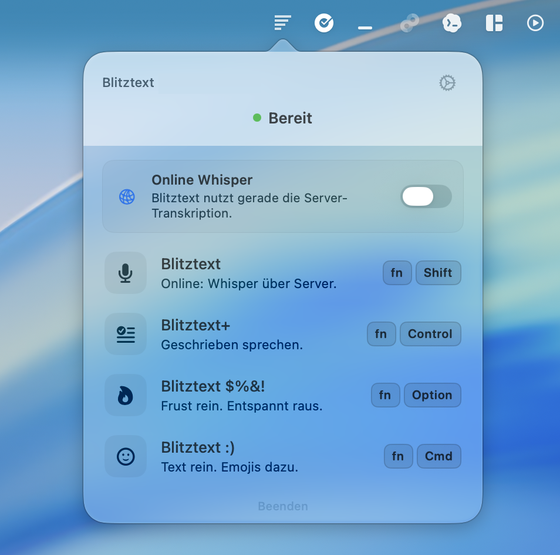
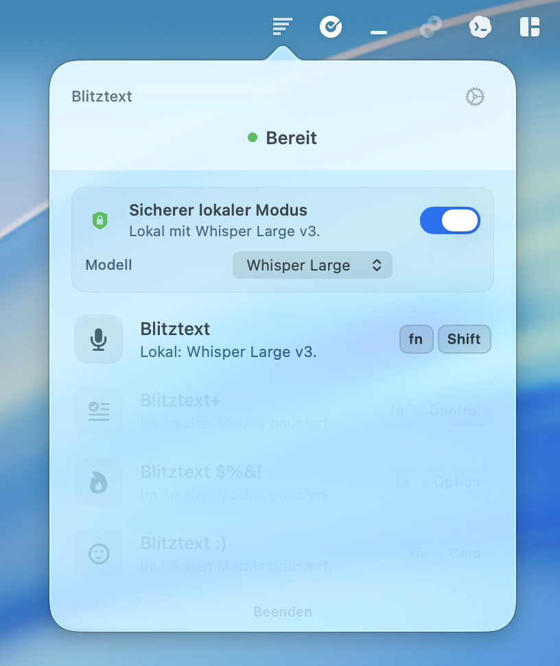
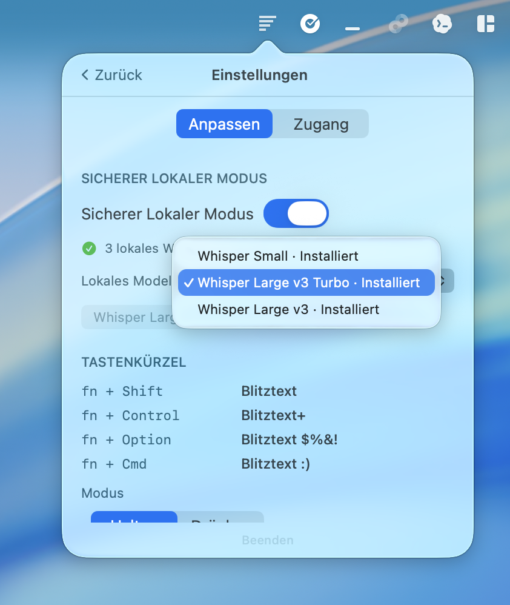
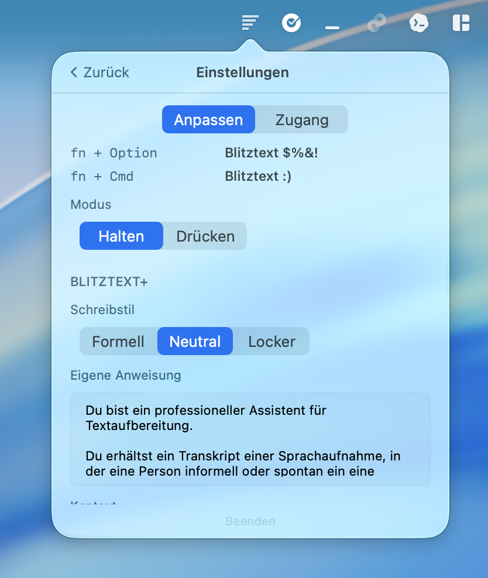

# QuickDictate

> **Based on:** [blitztext-app](https://github.com/cmagnussen/blitztext-app) by cmagnussen — MIT License.
> QuickDictate is an independent fork that replaces the OpenAI backend with [Groq](https://groq.com) and adds a portable Windows 11 version.
> The original MIT license and copyright notice are preserved. See [LICENSE](LICENSE).

QuickDictate is a macOS menubar app (and portable Windows 11 app) for turning speech into text — powered by the Groq API.

It is intentionally small and unfinished. The goal is to make a real workflow visible and hackable: press a hotkey, speak, get text back, optionally rewrite it, and paste it into the app you were using.

This is a learning and experimentation project, not a polished product.

> Preview status: bring your own Groq API key, no hosted backend, no warranty, no support guarantee.

## What It Does

**macOS (menubar app):**
- **Dictate**: record speech and transcribe it via Groq Whisper.
- **Dictate+**: transcribe, then improve the text with Groq Chat.
- **Vent**: turn frustrated speech into a calmer message.
- **Emojis**: add fitting emojis to dictated text.

**Windows 11 (portable, system tray):**
- `Ctrl+Shift+Space` → record → text lands in clipboard.
- Optional text improvement via Groq Chat.
- Settings window: API key, model selection, language.

## Important Preview Notes

- Bring your own [Groq API key](https://console.groq.com) — free tier available.
- No hosted backend. Audio goes directly from your device to the Groq API.
- macOS: `./build.sh` creates an ad-hoc-signed app. No notarized binary.
- Windows: portable `.exe`, no installer required. WebView2 must be present (pre-installed on Windows 11).
- Not production ready. No warranty.

## Windows 11 — Quick Start

```powershell
cd QuickDictateWindows
npm install
# Generate icons (once):
npx @tauri-apps/cli icon ..\BlitztextMac\Resources\Assets.xcassets\AppIcon.appiconset\icon_512x512.png
npm run build
# Or use the build script:
powershell -ExecutionPolicy Bypass -File build-windows.ps1 -Run
```

See [docs/BUILD_WINDOWS_PORTABLE.md](docs/BUILD_WINDOWS_PORTABLE.md) for full instructions.

## macOS — Quick Start
- No warranty and no support guarantee.

You are welcome to use, fork, adapt, and share this project under the license terms.

The intent is not to ship a one-click finished app. The intent is to make a real AI workflow understandable: clone it, build it, read the code, change it, break it, fix it, and suggest improvements. If you only want to download something and never look inside, this preview will probably feel rough. If you want to learn how a small native macOS AI app is put together, you are in the right place.

## Screenshots

<table>
  <tr>
    <td></td>
    <td></td>
  </tr>
  <tr>
    <td></td>
    <td></td>
  </tr>
</table>

## macOS Requirements

- macOS 14 or newer
- Xcode 16 or newer (Swift 5.10)
- [XcodeGen](https://github.com/yonaskolb/XcodeGen): `brew install xcodegen`
- A [Groq API key](https://console.groq.com) (free tier available)
- For local transcription: a WhisperKit CoreML model in `~/Library/Application Support/QuickDictate/models/whisperkit/`

Swift Package dependency (pulled automatically):
- [`argmax-oss-swift`](https://github.com/argmaxinc/argmax-oss-swift) (WhisperKit)

## Windows 11 Requirements

- Windows 11 (WebView2 pre-installed)
- [Rust](https://rustup.rs) stable
- [Node.js](https://nodejs.org) v18+
- A [Groq API key](https://console.groq.com)

## Build And Run

```bash
git clone https://github.com/cmagnussen/blitztext-app.git
cd blitztext-app
./build.sh --run
```

For a local install into `/Applications`:

```bash
./build.sh --install --run
```

The generated `.app` is ad-hoc signed for local development only. Do not treat it as a trusted redistributable binary. A public binary release would need Developer ID signing and notarization.

On first launch, either paste your own OpenAI API key for online workflows or install a WhisperKit CoreML model for local transcription. Rewriting workflows still require OpenAI.

For fully local transcription, install a WhisperKit CoreML model and enable **Sicherer Lokaler Modus** in the app.

For a slower, more explicit walkthrough, see [docs/setup.md](docs/setup.md).

## Permissions

Blitztext asks for:

- **Microphone**: to record your voice.
- **Accessibility**: to paste the result back into the app you were using.

If you do not grant Accessibility permission, you can still copy results manually.

Full Disk Access is not required. If auto-paste does not work even though transcription succeeds, open **System Settings -> Privacy & Security -> Accessibility**, enable Blitztext there, restart Blitztext, and try again with the cursor focused in a text field. If macOS shows multiple Blitztext entries, remove or disable the old ones and grant the permission to the app you just built or installed.

## Data Flow

The preview has no custom backend.

```text
Online transcription: Your Mac -> OpenAI Audio Transcriptions API
Text rewriting:       Your Mac -> OpenAI Chat Completions API
Local transcription:  Your Mac -> WhisperKit/CoreML on device
```

The app stores your OpenAI API key in the user's macOS Keychain.

Read [docs/privacy.md](docs/privacy.md) before using the preview with sensitive content.

## Project Structure

```text
BlitztextMac/
  App/          App lifecycle and paste handling
  Features/     Workflows, menu bar UI, settings
  Services/     Recording, OpenAI calls, hotkeys, local storage
  Views/        Shared SwiftUI views
build.sh        Local build script
docs/           Setup, privacy, roadmap, preflight, landing page notes
```

## Local Models

Local transcription is available as an experimental WhisperKit/CoreML path. The app does not bundle a model; choose one in the app, click install, and then switch on **Sicherer Lokaler Modus** from the menu bar or settings.

See [docs/local-models.md](docs/local-models.md).

## Contributing

Contributions are welcome, especially if they make the preview easier to build, understand, or fork.

Please read [CONTRIBUTING.md](CONTRIBUTING.md) first.

## Support And Roadmap

This preview has no formal support promise. See [SUPPORT.md](SUPPORT.md) for how to ask for help without sharing secrets.

The current direction is documented in [ROADMAP.md](ROADMAP.md). Maintainer-facing release checks live in [docs/open-source-preflight.md](docs/open-source-preflight.md).

## License

Code is released under the MIT License. See [LICENSE](LICENSE).

Project names, logos, and app icons are not automatically granted as trademarks or brand assets. See [TRADEMARKS.md](TRADEMARKS.md).

## Legal

This is an experimental, non-commercial open-source project, provided as-is under the MIT License without warranty or support. Nothing is sold here and no installation or operation is performed on your behalf.
